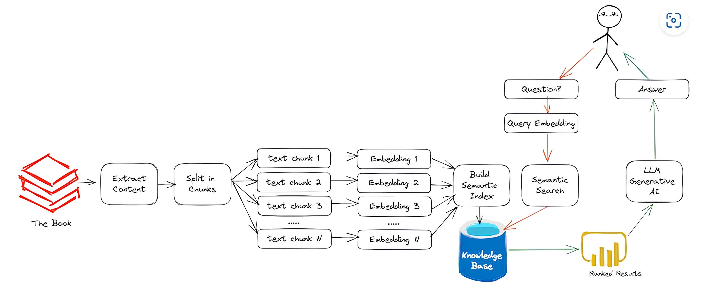

# 📚 Retrieval-Augmented Generation (RAG) PDF Assistant

##  Project Overview
This project is a **Retrieval-Augmented Generation (RAG) system** designed to extract knowledge from **multiple PDF books** and provide accurate answers based on their content. It uses **FAISS for semantic search** and **OpenAI's GPT model** for generating responses.

##  Features
- Upload multiple PDF books 📂
- Process and extract text from PDFs 📄
- Generate embeddings and store them in **FAISS Index** 
- Perform **semantic search** to retrieve relevant text 
- Use **GPT model** to generate human-like answers 
- Display the **source book and page number** for traceability 📖
- **Dockerized deployment** for easy execution 

---
##  Project Workflow


### **How It Works**
1. **Extract Content**: The system extracts text from PDF files.
2. **Split in Chunks**: The extracted text is split into smaller, meaningful chunks.
3. **Embedding Generation**: Each chunk is converted into an embedding vector using `sentence-transformers`.
4. **Semantic Indexing**: FAISS is used to store and search through embeddings efficiently.
5. **Question Processing**: User's query is converted into an embedding.
6. **Semantic Search**: The system retrieves the most relevant chunks based on cosine similarity.
7. **Answer Generation**: The retrieved information is passed to GPT to generate a response.
8. **Displaying Results**: The final answer includes **the source book and page number** for context.

---
##  Installation & Setup
### **Option 1: Run Locally**

### **1️⃣ Install Dependencies**
Ensure you have **Python 3.11+** and install dependencies:
```bash
pip install -r requirements.txt
```

### **2️⃣ Set Up Environment Variables**
Create a `.env` file and add your **OpenAI API Key**:
```bash
OPENAI_API_KEY=your_api_key_here
```

### **3️⃣ Run the Application**
```bash
streamlit run app.py
```
The app will start.

---
##  Option 2: Run with Docker

### **1️⃣ Build the Docker Image**
```bash
docker build -t rag_project .
```

### **2️⃣ Run the Docker Container**
```bash
docker run -e OPENAI_API_KEY=your_api_key_here -p 8501:8501 rag_project
```
The app will be accessible.

### **3️⃣ Share the Docker Image**
To share with others, save the image as a `.tar` file:
```bash
docker save -o rag_project.tar rag_project
```
Then, send `rag_project.tar` . They can **load and run it** using:
```bash
docker load -i rag_project.tar
docker run -p 8501:8501 rag_project
```

---
##  How to Use
1. **Upload PDF files** via the sidebar 📂
2. Click **Process PDFs & Generate Embeddings** to extract content 🔄
3. Choose **books** to search from 📚
4. Ask **any question** related to the PDFs 🔍
5. Get an answer with **source book and page number** 🎯

---
## 📦 Dependencies
All dependencies are listed in `requirements.txt`:
```
streamlit
openai
faiss-cpu
sentence-transformers
langchain
python-dotenv
PyMuPDF
```

---
## 🤖 Acknowledgements
- **FAISS** for fast similarity search
- **SentenceTransformers** for embeddings
- **Streamlit** for UI development
- **OpenAI GPT** for intelligent responses

---


